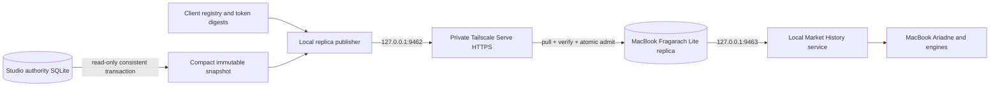

# Read-Only Replica Clients

Status: Studio publisher and MacBook Lite commissioned; signing remains gated
Date: 6 August 2026

## Purpose

Fragarach_2 remains the sole market-data authority on the Mac Studio. The
read-only replica subsystem publishes committed governed bars to explicitly
approved clients without giving those clients provider, acquisition,
correction, validation, or canonical-write authority.

The first client is intended to be Fragarach Lite on Ray's MacBook Pro. Ariadne
and consumer engines on that Mac will read the local Lite service, not contact
providers or open the Studio authority database.

## Non-regression boundary

This feature is additive and operationally isolated:

- it adds no table, trigger, migration, or write path to the authority database;
- acquisition, ingestion, validation, publication, Truth, Estate Truth,
  Scheduler, Market History, synthetic products, and provider routing are
  unchanged;
- read-only client state lives under a separate support root derived from the
  configured database path;
- the replica publisher uses its own LaunchAgent and cannot claim Scheduler
  acquisition ownership;
- it binds only to `127.0.0.1`; approved private exposure is through Tailscale
  Serve;
- publishing reads canonical rows in a consistent SQLite read transaction and
  writes a compact, separate replica database;
- access defaults to disabled.

The support root is:

```text
<authority-database>.read-only-clients/
```

It contains the client registry, publications, service status, and publisher
logs. Deleting or disabling this sidecar does not alter canonical evidence.

## Architecture



Both software sides are implemented and commissioned. Tailscale Serve exposes
the Studio loopback publisher through private tailnet HTTPS at
`https://raymonds-mac-studio.taila4c9c2.ts.net/`. Fragarach Lite is installed on
the MacBook and serves its verified local replica only on `127.0.0.1:9463`.

## Engine request boundary

An engine does not fetch market data and forward it through Ariadne. The engine
sends Ariadne the matching specification. Ariadne obtains the required windows
from the local Fragarach service and returns match results to the engine.

Each data window is explicit:

- `symbol`: governed canonical symbol or unambiguous registered alias;
- `timeframe`: governed lane such as `D1`;
- `start_utc`: inclusive beginning;
- `end_utc_exclusive`: exclusive end;
- `as_of_utc`: latest evidence the request is allowed to observe.

Current and comparison periods are separate windows and may differ in length.
That preserves Ariadne's flexibility for X-axis and Y-axis matching without
making Fragarach aware of an engine's algorithm. The current price graph uses
the same local Market History response. On the Studio it comes from
Fragarach_2; on the MacBook it comes from the verified Fragarach Lite copy, with
the Studio revision and response fingerprint attached.

## Native controls

The Fragarach II sidebar now contains **Read-Only Clients**. It provides:

- publisher access enable/disable;
- local publisher service install/start/stop/remove;
- full snapshot creation;
- client registration with symbol and timeframe scopes;
- one-time client-token display and copy;
- token rotation;
- client enable/disable;
- irreversible client revocation;
- current publication, payload size, lane count, revision, and signature state;
- clear separation between local publisher state and uncommissioned Tailscale
  exposure.

Tokens are generated with high entropy. Only their SHA-256 digests are stored.
The clear token is returned once when a client is added or rotated and is not
written to the authority database or publisher log.

## Command controls

All commands require `PYTHONPATH=src` when invoked from a source checkout.

Inspect state:

```bash
python -m fragarach_ii.commands.read_only_clients \
  --database /absolute/path/to/authority.sqlite3 \
  --mode status --json
```

Install the independent localhost service:

```bash
python -m fragarach_ii.commands.read_only_clients \
  --database /absolute/path/to/authority.sqlite3 \
  --mode service-install \
  --python /absolute/path/to/python3 \
  --repository /absolute/path/to/Fragarach_2 \
  --json
```

Add a client:

```bash
python -m fragarach_ii.commands.read_only_clients \
  --database /absolute/path/to/authority.sqlite3 \
  --mode add \
  --client-id macbook-pro \
  --display-name "Ray's MacBook Pro" \
  --symbols '*' --timeframes '*' --json
```

Create a compact full snapshot:

```bash
python -m fragarach_ii.commands.read_only_clients \
  --database /absolute/path/to/authority.sqlite3 \
  --mode publish-snapshot \
  --symbols '*' --timeframes '*' --json
```

Publishing a snapshot does not enable client access. Client access is a
separate explicit control.

## MacBook Lite controls

Configure the private Studio endpoint and store the one-time token without
placing the token in the command arguments or logs:

```bash
python -m fragarach_ii.commands.fragarach_lite configure \
  --endpoint https://raymonds-mac-studio.taila4c9c2.ts.net \
  --client-id macbook-pro

python -m fragarach_ii.commands.fragarach_lite store-token
```

`store-token` reads one line from standard input and writes it with owner-only
permissions. Synchronisation defaults to HTTPS and rejects unsigned or merely
labelled-as-signed publications until the signature verifier is commissioned.
`--allow-unsigned` is an explicit commissioning-only escape hatch; it does not
disable payload, database, lane, or authority fingerprint checks.

Install the independent MacBook service:

```bash
python -m fragarach_ii.commands.fragarach_lite service-install \
  --python /absolute/path/to/python3 \
  --repository /absolute/path/to/Fragarach_2
```

The LaunchAgent polls for a new snapshot every five minutes by default and
serves the last admitted replica on `127.0.0.1:9463`. A failed download or
verification never replaces the active replica. Loss of the Studio or network
therefore makes data stale, not absent or corrupt; the service continues with
the last verified revision and reports the sync failure.

## Private HTTP contract

The local service exposes:

```text
GET /health
GET /v1/replica/head
GET /v1/replica/publications?after=<authority_revision>
GET /v1/replica/publications/<publication_id>/manifest
GET /v1/replica/publications/<publication_id>/payload
GET /v1/replica/snapshots/<authority_revision>
```

Except for `/health`, every request requires an enabled registered bearer token
and must fall within that client's symbol/timeframe scope. Publisher access
must also be globally enabled. The server refuses non-loopback binding.

Snapshot payloads are gzip-compressed compact SQLite databases containing:

- replica metadata;
- public registration facts needed for identity;
- lane summaries and per-lane fingerprints;
- exact canonical OHLCV rows.

They do not contain provider credentials, raw provider payloads, provenance
blocks, Scheduler state, acquisition queues, or authority-write machinery.

The MacBook-local service exposes:

```text
GET /health
GET /v1/replica/status
GET /v1/market-history?symbol=<symbol>&timeframe=<lane>
    &start_utc=<inclusive>&end_utc_exclusive=<exclusive>&as_of_utc=<boundary>
```

It refuses non-loopback binding. Each successful history response carries the
admitted Studio authority revision, publication receipt, exact returned bar
count, and a SHA-256 fingerprint over the returned rows.

## Current Studio state

As of 6 August 2026:

- the independent publisher LaunchAgent is installed and running;
- it listens on `127.0.0.1:9462`;
- private `/health` returns `READY` through Tailscale HTTPS;
- client `macbook-pro` is enabled and limited to `AUDUSD/D1`;
- one 14,301-bar `AUDUSD/D1` full snapshot is published;
- the MacBook admitted authority revision
  `sha256:06621a530b03ea824733fbcc536d9f92c94b6756e8db5fe25da71425ad8bcb40`;
- Tailscale connectivity between the Macs is verified;
- Tailscale Serve is enabled and its private HTTPS health check succeeds;
- Fragarach Lite is installed as an independent 300-second LaunchAgent;
- signing keys, signature verification, and incremental deltas are not
  commissioned.

This is intentionally safe: a running local process does not grant data access.

## Cross-device commissioning proof

The first live proof completed on 6 August 2026. Lite admitted publication
`publication-5ef2df061d8f41588e8f0b350697b733` over Tailscale HTTPS after exact
payload, SQLite, lane, and authority-fingerprint verification. A local bounded
query for `AUDUSD/D1` from 1 July through 6 August returned exactly 33 bars with
response fingerprint
`sha256:8bb3f89a00bcbef48d2a9ae7d8066c43a5fc7f89a9ab4282a88d7f07f0abd970`.
A second sync returned `ALREADY_CURRENT`.

The one-time token was stored with mode `0600`. Its plaintext transfer copies
were removed from both Macs. The active commissioning exception is
`--allow-unsigned`; responses therefore correctly report only
`REPLICA_SIGNATURE_NOT_COMMISSIONED`. All other transport and content checks
remain enforced.

## Verification

The dedicated suite covers:

- sidecar-only client controls;
- one-time and rotated-token behaviour;
- disable and irreversible revoke behaviour;
- compact snapshot equality with canonical rows;
- source-database byte preservation;
- replica SQLite integrity;
- payload fingerprint verification;
- disabled, unauthorised, authorised, scoped, payload, and snapshot HTTP paths;
- rejection of non-loopback binding;
- independent Studio and MacBook LaunchAgent definitions;
- secure-by-default Lite admission;
- exact full-snapshot and bounded-history verification;
- tampered-download rejection with preservation of the active replica;
- offline use of the last verified replica;
- local history HTTP request validation and response provenance.

The focused authority/history regression set passes with the new tests. The
Swift package, operations checks target, and full Fragarach II application
compile with the new sidebar section.

A broader local run also exposed two pre-existing failures outside this feature:
one intraday test observes `PUBLICATION_PENDING` where it expects immediate
`AVAILABLE`, and one synthetic test expects 10 authority tables while the
current working tree creates 12. No replica code imports or modifies those
modules or authority tables.

## Remaining gates

1. Apply a tailnet grant restricting the publication endpoint to the MacBook.
2. Commission Studio manifest signing and MacBook signature verification, then
   remove `--allow-unsigned` from the MacBook LaunchAgent.
3. Expand client and publication scope beyond the commissioning lane as engine
   requirements are approved.
4. Add ordered incremental delta publications.
5. Test live disconnection, stale replica, revision discontinuity, and
   full-snapshot recovery.
