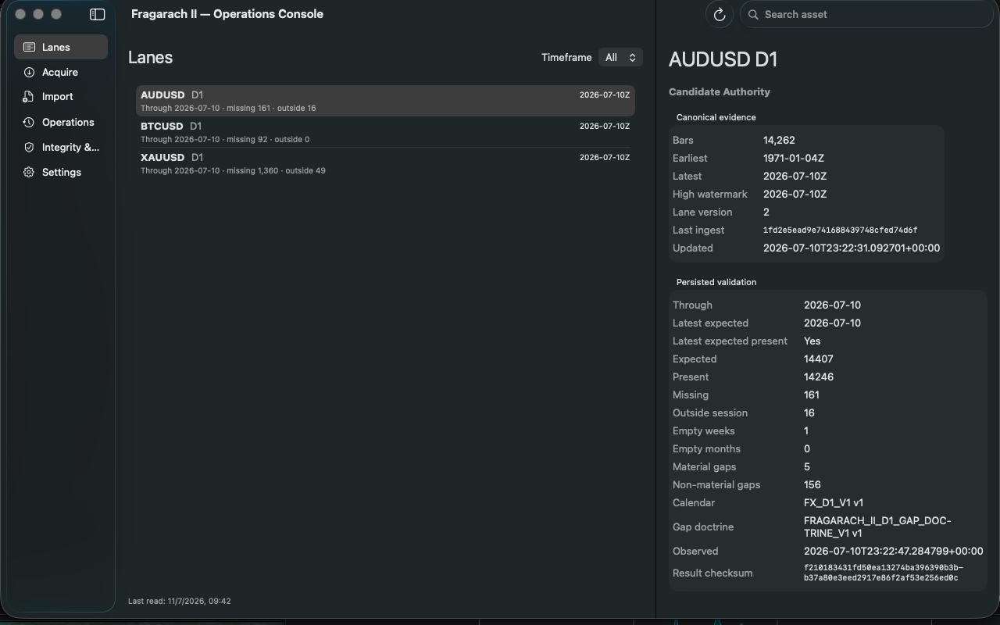
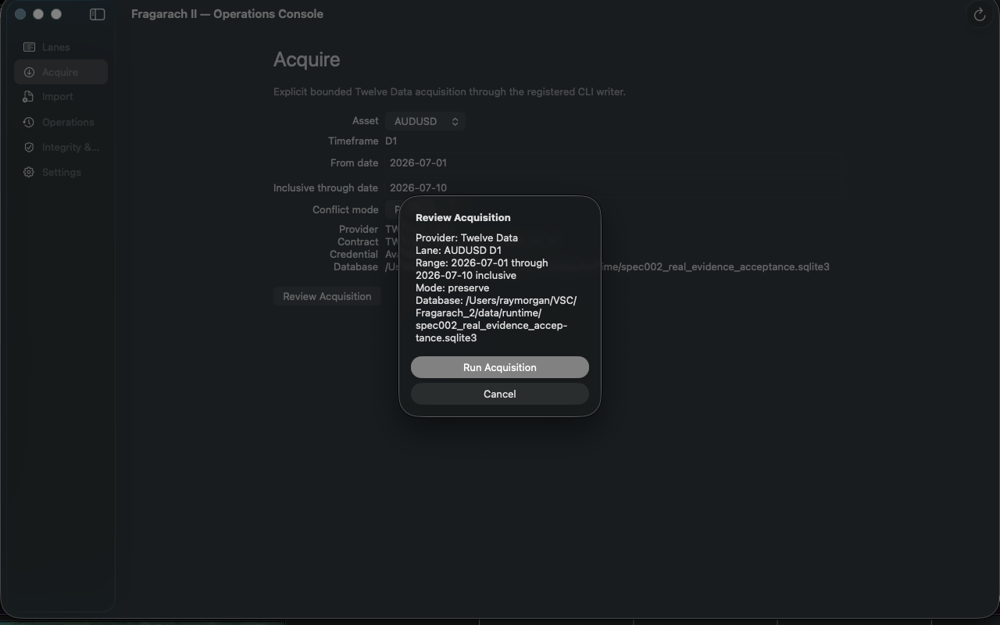
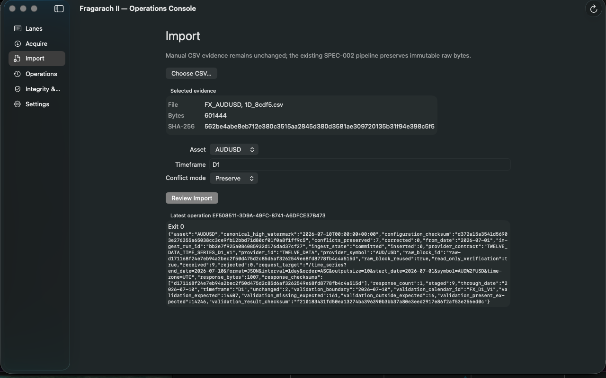
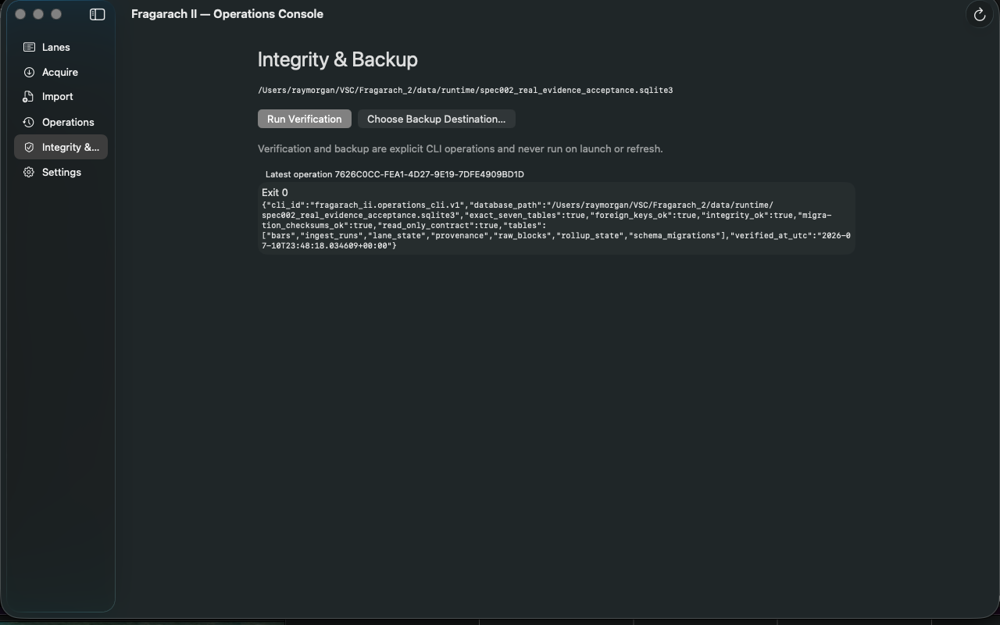
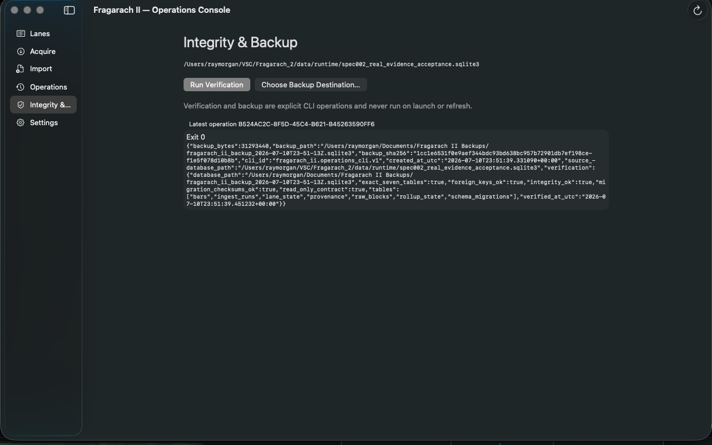
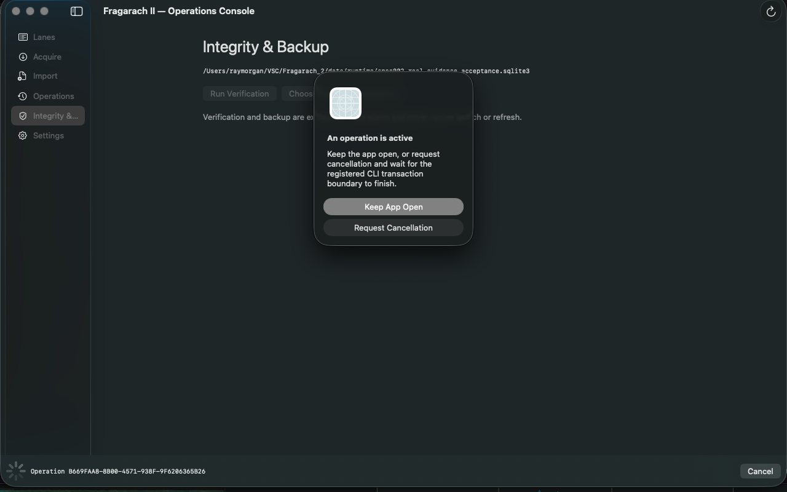

# SPEC-005 macOS Console — Runtime Acceptance Report

**Report date:** 2026-07-11

**Authority:** `data/runtime/spec002_real_evidence_acceptance.sqlite3`

## Outcome

The native `.app` built and launched on the Mac Studio without a web server, browser UI, or copied database. Initial lanes rendered within the two-second operational target. Selection and filtering were immediate, the app remained responsive while children ran, and idle behavior showed no refresh loop.

The proof exercised the real read layer, one explicitly reviewed provider replay, one explicitly reviewed manual-file replay, integrity verification, verified backup, controlled cancellation, and guarded quit behavior. Every authority change reconciles to the two confirmed existing CLI operations.

This is bounded operations-console proof, not production readiness. Fragarach II remains a **CANDIDATE AUTHORITY**.

## Read proof

The launch surface showed all three D1 lanes and persisted validation facts. AUDUSD displayed 16 outside-session observations and XAUUSD displayed 49; historical missing sessions remained visible even though the current expected session was present.



The read-only query reconciled to:

| Lane | Bars | Earliest UTC | Latest UTC | Outside expected |
|---|---:|---|---|---:|
| AUDUSD D1 | 14,262 | 1971-01-04 | 2026-07-10 | 16 |
| BTCUSD D1 | 6,031 | 2009-10-05 | 2026-07-10 | 0 |
| XAUUSD D1 | 13,258 | 1970-02-27 | 2026-07-10 | 49 |

Manual refresh, selection, sidebar navigation, search, and filtering caused no database count or file-byte change.

## Acquisition proof

The app resolved credential availability without displaying the value. The review surface showed only provider, AUDUSD D1, 2026-07-01 through 2026-07-10 inclusive, preserve mode, and the explicit authority path.



The confirmed replay committed one `provider_acquisition` run, reused the existing raw block, inserted zero bars, reported two unchanged facts and seven preserved conflicts, and appended nine provenance events. Read-only verification returned true. Canonical bar and raw-block counts did not change.

## Manual import proof

The native panel selected the existing AUDUSD operator CSV. Before confirmation, the app displayed its filename, 601,444-byte size, and SHA-256 `562be4abe8eb712e380c3515aa2845d380d3581ae309720135b31f94e398c5f5`.



The confirmed preserve-mode repeat committed one `manual_file` run, reused the existing raw block, inserted zero bars, reported 14,260 unchanged facts, and appended 14,260 provenance events. The source file's byte hash, size, mode, and mtime remained unchanged.

## Verification and backup

The explicit verification action separately reported integrity, foreign keys, migration checksums, exact seven tables, read-only contract, database identity, and timestamp as passing.



The corrected folder-selection workflow created and verified this external backup:

```text
/Users/raymorgan/Documents/Fragarach II Backups/fragarach_ii_backup_2026-07-10T23-51-13Z.sqlite3
```

| Fact | Value |
|---|---|
| Size | 31,293,440 bytes |
| SHA-256 | `1cc1e6531f0e9aef344bdc93bd638bc957b72901db7ef198cef1e5f078d10b8b` |
| Integrity | `ok` |
| Foreign-key violations | 0 |
| Migration checksums | passed |
| Exact seven tables | passed |



## Cancellation and quit proof

A controlled non-authority child fixture established one-active-operation exclusion and termination behavior. While it was active, Command-Q presented the required native choice to keep the app open or request cancellation. Request Cancellation terminated only the controlled child and kept the app open; no authority count changed.



The same controlled checks proved non-zero and malformed child results remain factual and do not disable read services. Existing Python tests separately prove provider failure rollback and credential-unavailable behavior.

## Before-and-after reconciliation

| Foundation fact | Before | After | Reconciled change |
|---|---:|---:|---|
| Canonical bars | 33,551 | 33,551 | 0 |
| Raw blocks | 6 | 6 | 0 |
| Provenance events | 67,150 | 81,419 | +14,269 |
| Ingest runs | 12 | 14 | +2 |
| Lane rows | 3 | 3 | 0 |
| Rollup-state rows | 0 | 0 | 0 |
| Schema migrations | 3 | 3 | 0 |

The provenance change is exactly 9 events from the provider replay plus 14,260 unchanged events from the manual replay. Both new runs committed. No correction, deletion, migration, rollup, or bar change occurred.

Post-proof `PRAGMA integrity_check` returned `ok`; foreign-key check returned no rows; the three migration checksums remained unchanged; and the table set remained exactly `bars`, `ingest_runs`, `lane_state`, `provenance`, `raw_blocks`, `rollup_state`, and `schema_migrations`.

## Secret and legacy boundary

The credential value was absent from captured app output, process arguments, preferences, tracked files, reports, screenshots, fixtures, Git history, SQLite/runtime files, and proof artifacts. The app displayed only `Available (redacted)`. No legacy Fragarach path, code, database, runtime, or data was accessed.

No commit was pushed and no consumer migration occurred. **Operations is King.**
