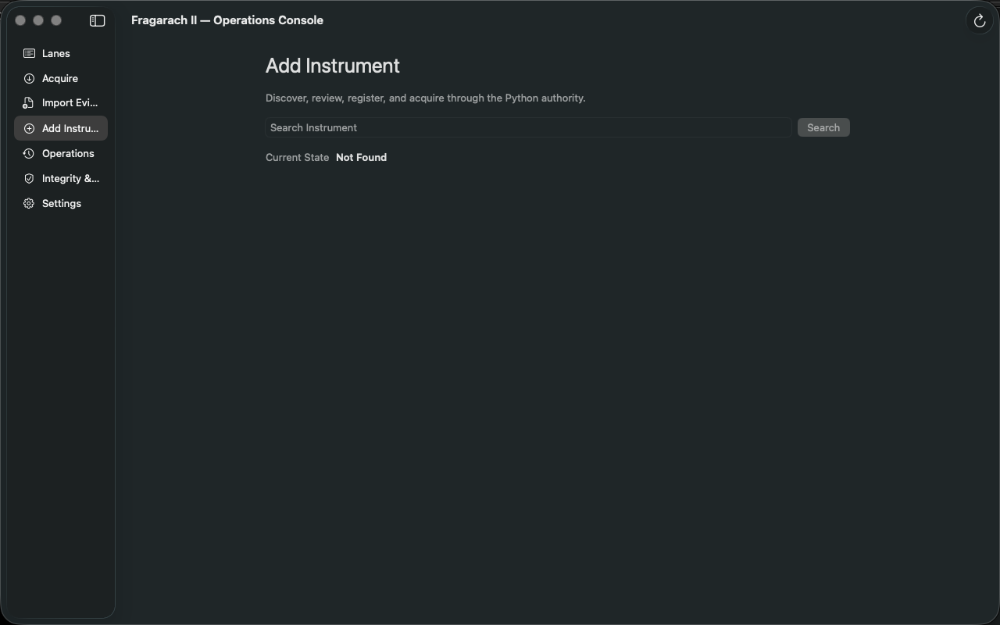

# SPEC-006 Native Instrument Registration and Acquisition — Acceptance Report

**Date:** 2026-07-11

**Status:** Implemented and locally accepted

**Authority:** Candidate Authority

## Outcome

The native macOS console now provides Add Instrument after Import Evidence. Search is a bounded Python-provider operation, review is read-only, registration calls the existing registered Python writer, and acquisition calls the unchanged SPEC-004 command. Swift contains no SQLite write path. Successful commands refresh the existing read-only authority snapshot, making a newly evidenced lane visible without restart.

Provider discovery maps only instrument families backed by an existing SPEC-003 calendar: FX, crypto, and precious metals. A provider match outside those families returns `CALENDAR_UNAVAILABLE`; no calendar or identity is inferred.

## Proof

- Python: `PYTHONPATH=src python3 -m unittest discover -s tests -v` — **86 passed**.
- Swift: `swift build` — **passed**.
- Native executable checks: `swift run OperationsCoreChecks` — **11 passed**.
- Launch: `./script/build_and_run.sh --verify` — app built, bundled, launched, and process verification passed.
- New focused tests prove read-only search, deterministic single-result selection, no-match handling, calendar-unavailable handling, one-row registration, `REGISTERED_NO_EVIDENCE`, and existing-registration reporting.
- Registration delegates to `storage.register_instrument`; acquisition delegates to `commands.acquire`; merge, validation, and factual status transition remain the existing paths.
- `src/fragarach_ii/storage/schema.py` is unchanged; migration history is unchanged.
- Existing evidence hashes remain identical to the accepted SPEC-002 report:
  - AUDUSD: `562be4abe8eb712e380c3515aa2845d380d3581ae309720135b31f94e398c5f5`
  - XAUUSD: `f4e12f8a823cd576c93b3fc364bfea1b3dd0a91fa47a813e0d3b2073f8b9165e`
  - BTCUSD: `573e65e61ad8c8a9320d0938aee929666ce77d8a3ccb7591fd008c8d8fdf511b`
- Secret scan found no credential material; the only credential-like match is the pre-existing intentional `fixture-only-secret` unit-test string.

## Runtime evidence

No remote push was performed. Fragarach II remains **CANDIDATE AUTHORITY**. **Operations is King.**
