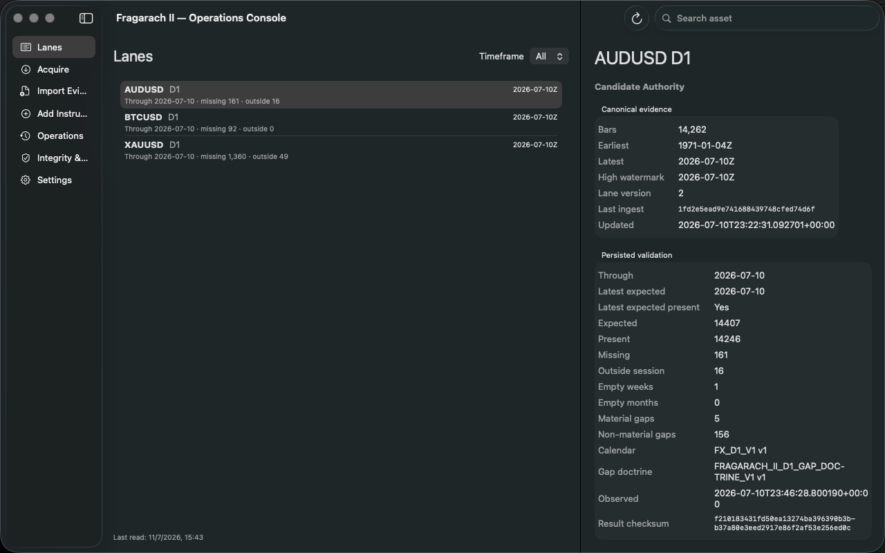

# SPEC-007 Generic Evidence Lane Foundation — Acceptance Report

**Date:** 2026-07-11

**Status:** Implemented and locally accepted

**Authority:** Candidate Authority

## Outcome

Migration 5 introduces the immutable `evidence_lanes` authority and changes the exact application-table boundary from eight to nine. Each lane belongs to one canonical registered instrument through an explicit registration identity reference. Existing registrations remain byte-for-byte unchanged and D1 remains the only declared and executable timeframe.

The migration backfills exactly three lanes: `AUDUSD D1`, `BTCUSD D1`, and `XAUUSD D1`. It replaces exact registration bar guards with exact evidence-lane guards. Python ingestion verifies the same registration-backed lane relationship before mutation. New instrument registration declares its D1 lane in the same registered-writer transaction without changing registration identity.

No lane-creation CLI, intraday acquisition, intraday validation, intraday import, new provider contract, or new native UI behavior was introduced.

## Migration and authority proof

- Migration 5 is checksummed and atomic.
- Injected interruption after the lane backfill rolls back the new table and restores the prior registration bar triggers.
- Evidence lanes prohibit update and deletion.
- A lane cannot reference an unregistered instrument.
- Bars require an exact declared evidence lane.
- A declared proof M5 lane does not authorize M30, demonstrating lane identity isolation without enabling an operational intraday path.
- Historical migrations 1–4 remain unchanged.

## Preservation proof

The runtime authority migrated through the registered Python writer and passed integrity, foreign-key, migration-checksum, exact-nine-table, and read-only checks.

- Bars: 33,551 rows; canonical digest `c58a3383cf89b2b599f5b9e772b0ca862579695659f692c6ecb727d28e59cf21` before and after migration.
- Raw blocks: 6 rows; canonical digest `eed82f7915adfa11665f5cc6085541e5445534ba9c06f13688a17cc85c3dc3a0` before and after migration.
- Registration identity checksums remain:
  - AUDUSD: `20c0355ae9ca4b6e1ffe6f24f5dc7920d036757e132c3e33e1648d5a86b7730f`
  - BTCUSD: `f3bbb3d7770a3ae0668d8b2a68e0e224df91123c4cff96e226e0223429a1042b`
  - XAUUSD: `f296a6ed305bc12146b6ed84a2fee22fcb70f1697889100c6ebaaa06074d136a`
- Accepted inbox evidence hashes remain identical to SPEC-002.
- Existing D1 acquisition, validation, provenance, evidence, and native presentation remain unchanged.

## Verification

- `PYTHONPATH=src python3 -m unittest discover -s tests -v` — **89 passed**.
- `swift build` — **passed**.
- `swift run OperationsCoreChecks` — **11 passed**.
- `./script/build_and_run.sh --verify` — **built, bundled, launched, and process-verified**.
- Secret scan — **clean**; only the intentional pre-existing `fixture-only-secret` test literal matched credential-shaped text.

## Runtime proof

No remote push was performed. Fragarach II remains **CANDIDATE AUTHORITY**. **Operations is King.**
